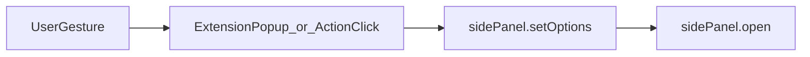
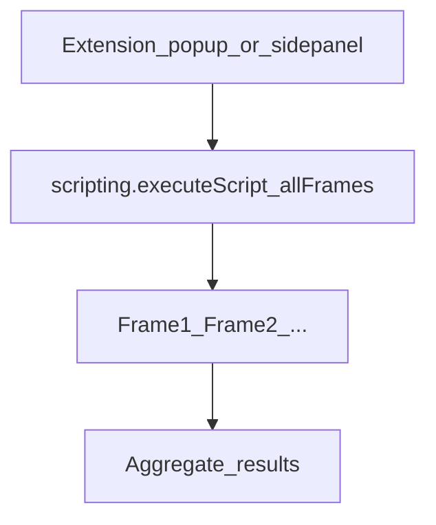

# Chrome 扩展：PDF 阅读场景 API 参考

本文档基于 **Google Chrome Extensions** 官方文档，面向「在浏览器中阅读在线 PDF（含站点内嵌 PDF、多 frame 文本层）」的扩展开发，汇总相关 API、权限、典型用法与**已知边界**。Chrome 并未提供名为「PDF 模式」的单独 API，下列能力需组合使用。

## 官方延伸阅读

| 主题 | 文档 |
| --- | --- |
| Side Panel | [chrome.sidePanel](https://developer.chrome.com/docs/extensions/reference/api/sidePanel) |
| Scripting | [chrome.scripting](https://developer.chrome.com/docs/extensions/reference/api/scripting) |
| Content scripts | [Content scripts 概念](https://developer.chrome.com/docs/extensions/develop/concepts/content-scripts) |
| Tabs | [chrome.tabs](https://developer.chrome.com/docs/extensions/reference/api/tabs) |
| 权限声明 | [Declare permissions](https://developer.chrome.com/docs/extensions/develop/concepts/declare-permissions) |
| Match patterns | [Match patterns](https://developer.chrome.com/docs/extensions/develop/concepts/match-patterns) |

---

## 1. 场景与术语

- **直接打开 PDF URL**：例如 `https://arxiv.org/pdf/1706.03762`（路径常含 `/pdf/`，未必以 `.pdf` 结尾）。
- **站点内嵌 PDF**：通过 `<iframe>`、PDF.js、期刊阅读器等嵌入；文本选择与 DOM 往往位于 **子 frame**，而非顶层 `window`。
- **阅读助手常见需求**：右侧固定面板（摘要/翻译/批注）、读取用户**选中文本**、按 URL 启用不同行为。

因此需关注：**多 frame**、**脚本注入范围**、**侧边栏打开是否属于用户手势**。

---

## 2. 权限与 Manifest 速查

Manifest V3 下，PDF 阅读类扩展常见组合如下（按功能勾选，避免过度申请）。

| 能力 | 权限 / 字段 | 说明 |
| --- | --- | --- |
| 侧边栏 UI | `permission`: `"sidePanel"` | 使用 `chrome.sidePanel.*` 必填 |
| Manifest 默认侧栏页 | `"side_panel": { "default_path": "sidepanel.html" }` | 包内相对路径 |
| 在网页中执行注入脚本 | `permission`: `"scripting"` | 使用 `chrome.scripting.executeScript` 等 |
| 对 HTTPS 页面注入 | `host_permissions`: `["https://*/*"]` 或更窄的 `matches` | 与 `scripting` 配合；或使用 `activeTab` 临时权限（见官方说明） |
| 标签页元数据 | 常配合 `tabs`（若需） | `chrome.tabs.query` 等；部分场景可用 `activeTab` 减少常驻权限 |

> **说明**：`scripting` 文档要求同时声明 `scripting` 与对目标页的访问方式（`host_permissions` 或 `activeTab`）。具体以 [chrome.scripting](https://developer.chrome.com/docs/extensions/reference/api/scripting) 为准。

---

## 3. `chrome.sidePanel`（右侧阅读面板）

**适用版本**：Chrome 114+（MV3）。**权限**：`sidePanel`。

### 3.1 常用能力

| API / 配置 | 作用（PDF 场景） |
| --- | --- |
| `side_panel.default_path` | 扩展侧栏 HTML 入口，全站或默认行为 |
| `chrome.sidePanel.setOptions({ tabId, path, enabled })` | 按**标签页**启用侧栏、指定页面路径；可用于「仅在某些 URL 显示」 |
| `chrome.sidePanel.open({ tabId })` 或 `open({ windowId })` | **打开**侧栏（Chrome 116+） |
| `chrome.sidePanel.setPanelBehavior({ openPanelOnActionClick: true })` | 用户点击工具栏扩展图标时与侧栏联动 |

### 3.2 关键约束（官方）

- **`chrome.sidePanel.open()` 只能在用户手势响应中调用**（例如：点击扩展 popup 内按钮、工具栏图标、快捷键、右键菜单等）。  
  在 **`tabs.onUpdated` 等后台事件**中直接调用 `open()` 会失败（错误信息类似：`sidePanel.open() may only be called in response to a user gesture`）。
- **推荐做法**：后台仅做 `setOptions`（注册/启用当前标签页的侧栏配置）；**真正「打开」侧栏**放在 popup 按钮、`setPanelBehavior`、或内容脚本/菜单的用户点击之后。

### 3.3 流程示意（用户手势打开侧栏）



### 3.4 与「自动出现」的区分

- **`setOptions`**：配置侧栏是否对该 tab 可用、路径为何，**不等于**自动弹出 UI。
- **`open`**：显式打开侧栏，**必须**有用户手势链。

---

## 4. `chrome.scripting`（跨 frame 读取选中文本）

**权限**：`scripting` + 对目标页的 `host_permissions`（或 `activeTab` 等策略）。

### 4.1 `executeScript` 与 `allFrames`

向指定 `tabId` 注入函数：

```ts
chrome.scripting.executeScript({
  target: { tabId, allFrames: true },
  func: () => (window.getSelection()?.toString() ?? "").trim()
})
```

- **`allFrames: true`**：在标签页内**所有符合注入条件**的 frame 中执行（官方文档：[InjectionTarget](https://developer.chrome.com/docs/extensions/reference/api/scripting#type-InjectionTarget)）。
- **返回值**：`InjectionResult[]`，**每个 frame 一条**；文档说明**主 frame 的结果在数组中保证为第一项**，其余 frame **顺序非确定**。
- **PDF 阅读意义**：选区常在 iframe / 文本层所在 frame，仅读顶层 `document` 容易得到空字符串；应在结果中**聚合**（例如取各 frame 返回字符串中最长非空）。

### 4.2 流程示意（选区采集）



### 4.3 与 `MAIN` world（可选）

`executeScript` 支持 `world: "MAIN" | "ISOLATED"`（见官方 `ExecutionWorld`）。若需与页面脚本共享同一 DOM 世界，可按官方说明评估；默认多为 `ISOLATED`。

---

## 5. Content scripts（与 `scripting` 互补）

静态声明（manifest `content_scripts`）适合**持续**注入：

| 字段 | PDF 相关说明 |
| --- | --- |
| `matches` | 匹配哪些 URL 注入（如 `https://*/*` 或更窄） |
| `all_frames` | `true` 时向**所有匹配 URL 要求的 frame** 注入，不仅顶层 |
| `match_origin_as_fallback` | 与「由匹配页创建的、URL 不直接匹配」的 frame 有关（如部分 `about:` / `data:` 等场景），见官方 [Injecting in related frames](https://developer.chrome.com/docs/extensions/develop/concepts/content-scripts#injecting-in-related-frames) |

**隔离世界（isolated world）**：内容脚本运行在扩展隔离环境，与页面 JS 变量不共享；`window.getSelection()` 等仍针对该 frame 的 DOM。官方说明见 [Work in isolated worlds](https://developer.chrome.com/docs/extensions/develop/concepts/content-scripts#isolated_world)。

---

## 6. 消息与生命周期（工程实践）

### 6.1 `chrome.tabs.sendMessage` 与多 frame

若多个 frame 均注册 `chrome.runtime.onMessage`，**先**调用 `sendResponse` 的 frame 会决定 Promise 结果；顶层 frame 若先返回空选区，可能导致「始终读不到 iframe 内选区」。PDF 场景更稳妥的做法之一是使用上一节的 **`scripting.executeScript` + `allFrames` 聚合**。

### 6.2 `Extension context invalidated`

扩展**热重载或更新**后，已打开页面中的旧 content script 可能仍执行，但 `chrome.runtime` 已失效，访问会抛出 **Extension context invalidated**。开发时应在重载扩展后**刷新 PDF 标签页**。这与具体 PDF API 无关，但是 PDF 阅读插件调试时的常见问题。

---

## 7. 限制与免责声明（诚实边界）

- **并非所有 PDF 环境都能注入**：跨源 iframe、特殊 scheme、`chrome://` 内置页等，受 [host 权限与匹配规则](https://developer.chrome.com/docs/extensions/develop/concepts/match-patterns) 与浏览器安全策略限制。
- **文本可选中 ≠ 一定能通过 `getSelection` 拿到**：取决于阅读器实现（画布渲染、影子 DOM 等）。
- **其他 Chromium 浏览器**（如 Edge）通常兼容同类 API，但发布前应在目标浏览器版本上实测。

---

## 8. 与本仓库文件的对照（Impulse / Plasmo）

本仓库为 [Plasmo](https://docs.plasmo.com/) 项目，下列文件与上述 API 的对应关系如下（便于维护时跳转源码）。

| 说明 | 路径 |
| --- | --- |
| Manifest 合并：`side_panel`、`permissions`（`sidePanel`、`scripting`）、`host_permissions` | [package.json](../package.json) 中 `manifest` 字段 |
| Service worker：按 PDF URL 调用 `sidePanel.setOptions`（不依赖非手势的 `open`） | [background.ts](../background.ts) |
| 侧栏 UI（summary / translation / highlight / comment） | [sidepanel.tsx](../sidepanel.tsx) |
| Popup：用户手势下可调用 `sidePanel.open`、触发选区读取 | [popup.tsx](../popup.tsx) |
| 使用 `chrome.scripting.executeScript` + `allFrames` 聚合选区 | [utils/get-selection.ts](../utils/get-selection.ts) |
| 静态 content script：`GET_SELECTION`、`all_frames`、上下文失效防护 | [contents/selection.ts](../contents/selection.ts) |

---

## 文档修订

当 Chrome 升级 API 行为（尤其是 `sidePanel.open` 手势要求、最低版本号）时，请以 [Chrome for Developers](https://developer.chrome.com/docs/extensions) 当前页面为准，并同步更新本文档中的版本说明与表格。
